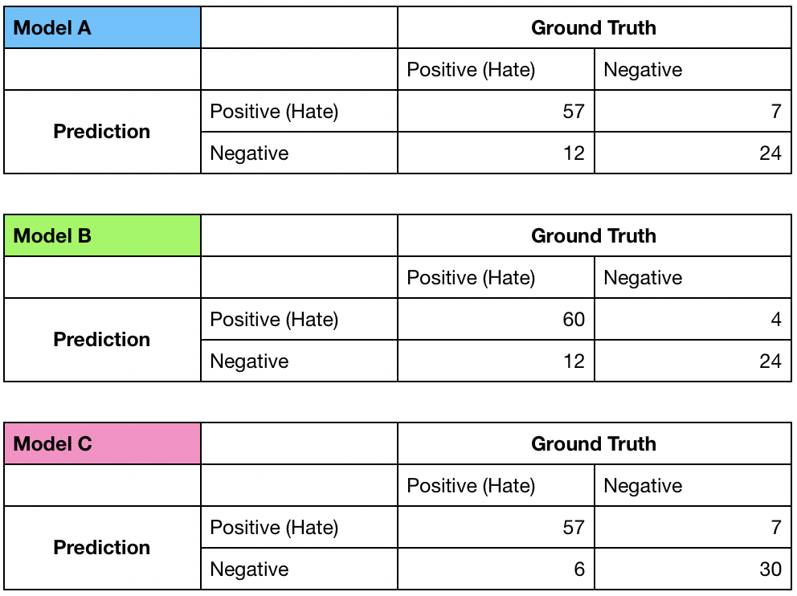

# Assessment
The following question set is adapted from the pre-interview assessment form used in [Algoritma]'s (https://algorit.ma) hiring for teaching members of the team.

## Fundamentals
1. Assuming a simple linear regression (ordinary least squares) trained on a dataset with one predictor. This model is likely to exhibit:
    - [ ] A high bias and high variance  
    - [ ] A low bias and low variance
    - [ ] A high bias but low variance
    - [ ] A low bias but high variance

2. Which of the following is the most fitting definition of _p-value_:
    - [ ] Probability of obtaining a result or value more extreme than was observed
    - [ ] Probability of a null hypothesis to evaluate to **False**
    - [ ] Probability of the alternate hypothesis to be correct
    - [ ] Probability of a variable being insignificant to the true parameters of a model

3. Which is the correct formula for calculating model's **sensitivity**?
    - [ ] True Positives / (True Positives + False Negatives)
    - [ ] True Positives / (True Positives + False Positives)
    - [ ] True Positives / Total Predictions 
    - [ ] True Negatives / Total Predictions  

> Refer to `threemodels.png` directly in the same directory if the image is not rendered for the following question.

4. You want a model that identify hateful tweets on Twitter and you're presented with three candidates (Model A, Model B, and Model C). You are asked to pick the model with the **highest precision**. Which of the following models have the highest precision?

    - [ ] Model A
    - [ ] Model B
    - [ ] Model C

5. We want to be confident that our model can perform reasonably in real world environments, and not overfitted to the dataset it was trained on. What is a strategy that greatly diminish the possibility of overfitting?
    - [ ] Gradient optimization
    - [ ] Grid Search
    - [ ] Train-Test Splitting

6. One difference between a supervised learning task and an unsupervised learning task is the presence of a target variable. Which of the following best describes a target variable?
    - [ ] A target variable is also an indendent variable
    - [ ] Target variable is an isolated variable taken in a separate data collection process
    - [ ] Target variable is dependent to independent variable

## Practical Hands-On
7. Download `analytics.csv`, which is export as-is from the company's Google Analytics dashboard. Values in the `Language` column is formatted to capture both the client (browser) language and keyboard language, but for this exercise we're only interested about the former. A value of `en-id` should hence be stored as `en`, and a value of `id-jp` should similarly be `id`. Fill missing values with `missing`. This should result in `en`, `id`, `th` and `missing` as valid values in the `Language` column. Which language has on average, the highest `Pages / Session` count?
    - [ ] `en`, or English
    - [ ] `id`, or Indonesian
    - [ ] `th`, or Thai

8. Use any tools of your choice, run a closed-form, simple linear regression to predict `Goal Conversion Rate` (target) using the values of `Pages / Session` (predictor). Call this `model_A`. What is the multiple R-squared from your simple linear regression, `model_A`, rounded to 3 decimal points? You can retrieve this value through `sklearn.metrics.r2_score` or `summary(model)$r.squared`
    - [ ] 0.786
    - [ ] 0.826
    - [ ] 0.866

9. Let $\beta_0$ (beta0) be the intercept and $\beta_1$ be your slope. What is the value of `beta0`?
    - [ ] -25.188
    - [ ] 8.65
    - [ ] 0
    - [ ] 0.00268

10. Add `Language` as an additional predictor to the earlier linear regression model. Call this `model_B`. Did your **multiple R-squared model** improved as a result? Compare the **adjusted R-squared** of two models `model_A` and `model_B`. 
    - [ ] `model_A` has a higher multiple $R^2$ and adjusted $R^2$ value 
    - [ ] `model_B` has a higher multiple $R^2$ and adjusted $R^2$ value 
    - [ ] `model_A` has a higher multiple $R^2$ but lower adjusted $R^2$ value 
    - [ ] `model_B` has a higher multiple $R^2$ but lower adjusted $R^2$ value 